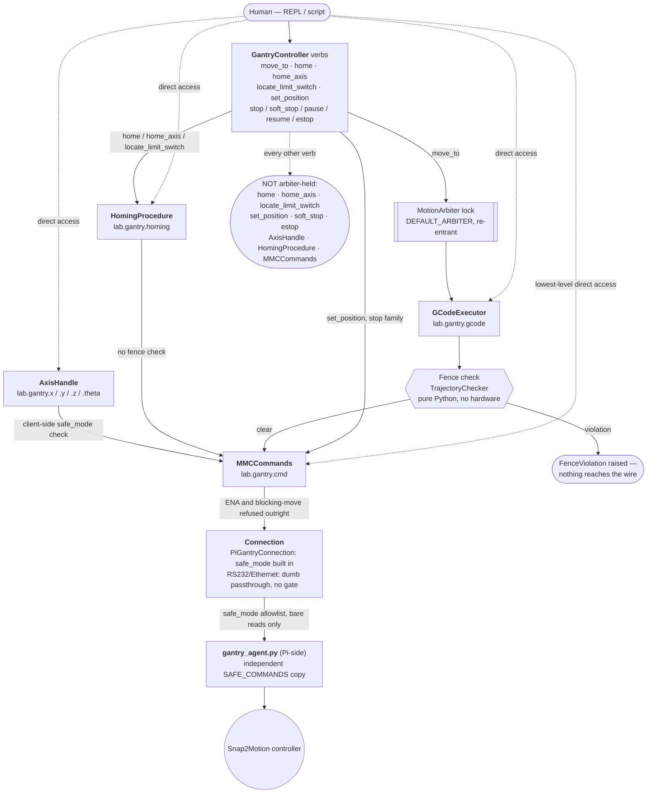

# Motion control layers & guards

There are several different entry points that can put the gantry in
motion. They do **not** all carry the same guards — some skip fence
checking entirely, some rely on a guard that only exists on one transport,
and one path skips keeping two position caches in sync (see the gotcha
below). This page is the map: which layer you're calling, what actually
protects you when you call it, and what doesn't.

Read this before reaching past `GantryController`'s verbs
(`move_to()`/`home()`/`home_axis()`/`locate_limit_switch()`/etc.) into
`.gcode`, `.homing`, `.cmd`, or a per-axis `.x`/`.y`/`.z`/`.theta` handle
directly — those are all real, supported entry points, but each drops a
different subset of the guards described here.

## The layers

| Layer | Reached via | Fence-checked? | `safe_mode`-gated? | Arbiter-held? | Position caches synced? |
|---|---|---|---|---|---|
| `GCodeExecutor` | `lab.gantry.move_to()`, `lab.gantry.gcode.plan()/execute()` | **Yes** — the only path that is | Yes, via transport (below) | Yes — the only layer that is (`move_to()` specifically; direct `.gcode.plan()/execute()` calls skip it) | Yes — own `_current_pos`/`_current_theta`, always current for its own moves |
| `HomingProcedure` | `lab.gantry.home()`, `.home_axis()`, `.locate_limit_switch()` (`GantryController` wrappers) | **No** | Yes, via transport (below) | **No** | Yes — the wrapper calls `_sync_position_after_direct_motion()` after |
| `HomingProcedure` | `lab.gantry.homing.home_axis()` / `.locate_limit_switch()` **directly** | **No** | Yes, via transport (below) | **No** | **No** — nothing resyncs gcode's cache or the checkpoint file; do this and your next `move_to()` can plan against a stale position |
| `AxisHandle` | `lab.gantry.x.move_to()` etc. | **No** | Yes — transport, **plus** its own client-side check (the only gate at all on RS232/Ethernet) | **No** | **No** |
| `MMCCommands` | `lab.gantry.cmd.begin_move_to()` etc. | **No** | Yes, via transport only — **no client-side check at all** | **No** | **No** |
| Safety verbs | `stop()`/`soft_stop()`/`pause()`/`resume()`/`estop()` | N/A (never start motion) | Stop commands aren't on the `safe_mode` allowlist either — see the gotcha below | **No** | Yes — all four sync after |

## Guard-by-guard

### Fences — `TrajectoryChecker` / `CheckedTrajectory`

Pure in-memory, no hardware needed. `GCodeExecutor.execute()` only accepts
a `CheckedTrajectory` produced by its own `plan()` call (checked by
identity), so a fence check can never be silently skipped for **G-code-
driven** motion — see `fences.py` and `docs/MACRON_GANTRY.md`'s safety
model section.

**This is the one guard that doesn't apply everywhere.** `HomingProcedure`,
`AxisHandle`, and raw `MMCCommands` calls all move hardware with axis-
prefixed ASCII commands (`JOG`, `BMT`, `BMB`) sent straight to `MMCCommands`
— none of that passes through `TrajectoryChecker` at all. A fence defined
in config protects `move_to()`/`acquire_scan()`; it does **not** protect a
homing jog or a bare `lab.gantry.x.move_to(...)` call.

### `safe_mode` — the `SAFE_COMMANDS` allowlist

The one guard that *is* structurally universal, given the default
transport. `PiGantryConnection.send()` (and any connection wrapped in
`SafeModeConnection`) checks every outgoing command's mnemonic against
`SAFE_COMMANDS` in `pi_bridge.py` — a bare-read-only allowlist (`INB`,
`ACP`, `SPD`, `CAB`/`CAP`/`CAT`, etc.) — **before a single byte reaches the
wire**. Motion mnemonics (`JOG`, `BMT`, `BMB`) simply aren't on it, so
while `safe_mode=True` (the default everywhere), no motion can be
commanded through this transport regardless of which higher layer issued
it — `GCodeExecutor`, `HomingProcedure`, `AxisHandle`, and raw
`MMCCommands` calls are all caught the same way, because they all end up
calling the same `connection.send()`. `gantry_agent.py` keeps an
independent copy of the same table on the Pi side as defense in depth.

**Gotcha: stop commands are blocked too.** `BST`/`ABT`/`STP` aren't on
`SAFE_COMMANDS` either, so `soft_stop()`/`estop()` would also be refused
by the transport while `safe_mode=True`. This is fine, not a bug — under
`safe_mode=True` no motion could have started in the first place, so
there's structurally nothing to stop. It only becomes relevant once
`safe_mode=False`.

**Gotcha: `RS232Connection`/`EthernetConnection` have no allowlist at
all** — they're deliberately dumb passthroughs (see `pi_bridge.py`'s
`SafeModeConnection` docstring). On those transports, `AxisHandle`'s own
client-side check (`_check_motion_allowed()`, gating `move_to`/`move_by`/
`begin_move_to`/`begin_move_by`/non-zero `jog`) is the **only** thing
stopping motion — and it only exists on `AxisHandle`. `HomingProcedure`
and raw `MMCCommands` calls go straight to `MMCCommands`, which has no
gate of its own, so **on these transports, homing and raw `cmd` calls have
no `safe_mode` protection whatsoever.** Use `PiGantryConnection` (the
default) or wrap the connection in `SafeModeConnection` if you're on
RS232/Ethernet and want this to actually hold.

### `ENA` ban and blocking-motion ban

Structural, in `MMCCommands` itself — no transport involved, so these
apply no matter which layer calls in. `ENA` on a responder-node axis
crashes the controller (confirmed directly on hardware); it's refused at
three independent layers (`MMCCommands` construction, `PiGantryConnection
.send()`, `gantry_agent.py`). Blocking motion primitives (`MVT`/`MVB`,
blocking group forms) are refused outright the same way — they hold a
wire round trip open for an unbounded time; every caller uses the non-
blocking `begin_move_to`/`begin_move_by` + poll instead.

### Position-cache sync — `GCodeExecutor._current_pos`/`_current_theta` + the on-disk checkpoint

`GCodeExecutor` keeps its own cached idea of where the gantry is, and only
refreshes it when *it* commands a move. `HomingProcedure`,
`AxisHandle.move_to()`, and raw `MMCCommands` calls all move real hardware
without going anywhere near that cache. Left unhandled, this is exactly
the shape of bug this asymmetry produces: homing an axis, then calling
`move_to()`, can produce **SnapMotion error 16** ("0 Or Negative" accel) —
the executor plans a leg against a stale cached position, and the
resulting distance mis-scales `ACL`/`DCL` down to 0. See
`GCodeExecutor._sync_position_from_hardware`'s docstring for the full
mechanism.

Fixed for the `GantryController` wrapper verbs — `home()`, `home_axis()`,
`locate_limit_switch()`, `set_position()`, `soft_stop()`, `estop()` all
call `_sync_position_after_direct_motion()` afterward, which refreshes
**both** the in-memory gcode cache and the on-disk position checkpoint
file (`position_store.py`, used by `restore_last_position()` after a power
cycle). **Not fixed, and not fixable in general**, for direct
`lab.gantry.homing.home_axis()`/`.locate_limit_switch()` calls, or for
`AxisHandle`/raw `MMCCommands` motion — those bypass `GantryController`
entirely, so nothing resyncs anything. If you call any of those directly,
call `lab.gantry.gcode.sync_position_from_hardware()` yourself before your
next `move_to()`.

### Motion arbiter — `laguna.robot.motion_arbiter`

Orthogonal to everything above: a re-entrant lock over a whole motion
*operation* (not a per-command lock), held via `arbiter.hold(description,
timeout_s)`. Guards against two threads issuing motion at once, not
against any particular command being unsafe. `GantryController.arbiter`
defaults to a process-wide singleton (`DEFAULT_ARBITER`).

**It is not held nearly as broadly as you'd guess.** Grepping for
`arbiter.hold(` turns up exactly two call sites in this codebase:
`GantryController.move_to()` ([controller.py:704](https://github.com/ericbarefoot/laguna/blob/develop/src/laguna/robot/macron/controller.py))
and `TopographicProfiler.scan_with_gantry()` — the re-entrancy exists
specifically so a scheduled scan can call `move_to()` from inside its own
held arbiter without deadlocking. **Every other `GantryController` verb —
`home()`, `home_axis()`, `locate_limit_switch()`, `set_position()`,
`soft_stop()`, `estop()` — runs without acquiring it at all**, and neither
`AxisHandle`, `HomingProcedure`, nor raw `MMCCommands` calls ever touch it.
Two threads homing an axis and running a scan at the same time have
**nothing** serializing them against each other.

### Safety verbs — `pause`/`resume`/`stop`/`estop`

The cross-subsystem vocabulary from `safety.py`, distinct from the guards
above — these are what you call to *stop* something, not what stops you
from *starting* something. `stop()` decelerates cleanly (safe to
disconnect from); `estop()` is the hardest halt (zero-decel abort, brakes
engaged, motors disabled, requires an explicit re-arm). See `safety.py`'s
module docstring for the full vocabulary and why `GantryController.stop()`
changed meaning.

## Which layer should I actually call?

| I want to... | Use | Not this |
|---|---|---|
| Move to a coordinate, fence-checked | `lab.gantry.move_to(...)` | `lab.gantry.x.move_to(...)` — no fence check |
| Home every configured axis | `lab.gantry.home()` | `lab.gantry.homing.home_all()` directly — skips the position-cache resync |
| Home/test one axis interactively | `lab.gantry.home_axis(axis)` | `lab.gantry.homing.home_axis(axis)` directly — same resync gap |
| Find a limit switch's position | `lab.gantry.locate_limit_switch(axis)` | `lab.gantry.homing.locate_limit_switch(axis)` directly — same gap |
| Declare position without moving | `lab.gantry.set_position(...)` | manually poking `cmd.set_actual_position()` — skips the resync |
| Run a custom G-code program | `lab.gantry.gcode.plan()`/`.execute()` | fine as-is — this *is* the fence-checked path |
| Poke one axis for debugging/tuning (e.g. `get_speed()`, `read_axis_state()`) | `lab.gantry.x` (read-only methods) | — |
| Jog one axis by hand outside any of the above | `lab.gantry.x.move_to()`/`.jog()`, **knowing there's no fence check**, then call `lab.gantry.gcode.sync_position_from_hardware()` before your next `move_to()` | leaving the cache stale |
| Stop everything right now | `lab.gantry.stop()` (controlled) or `.estop()` (hardest halt) | — |

## See also

- [`docs/guides/gantry-motion.md`](guides/gantry-motion.md) — the
  `move_to()`/fence/`safe_mode` walkthrough this page assumes as
  background.
- [`docs/MACRON_GANTRY.md`](MACRON_GANTRY.md) — protocol/wiring reference,
  including the "Safety model (defense in depth)" section this page
  expands on.
- [`src/laguna/safety.py`](https://github.com/ericbarefoot/laguna/blob/develop/src/laguna/safety.py)
  — the `pause`/`resume`/`stop`/`estop` vocabulary.
- [`examples/example_09_gantry_home_axis_test.py`](https://github.com/ericbarefoot/laguna/blob/develop/examples/example_09_gantry_home_axis_test.py)
  — a worked per-axis homing script using the resync-safe wrappers.
