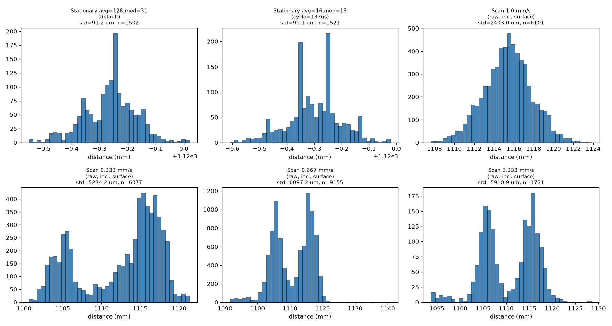
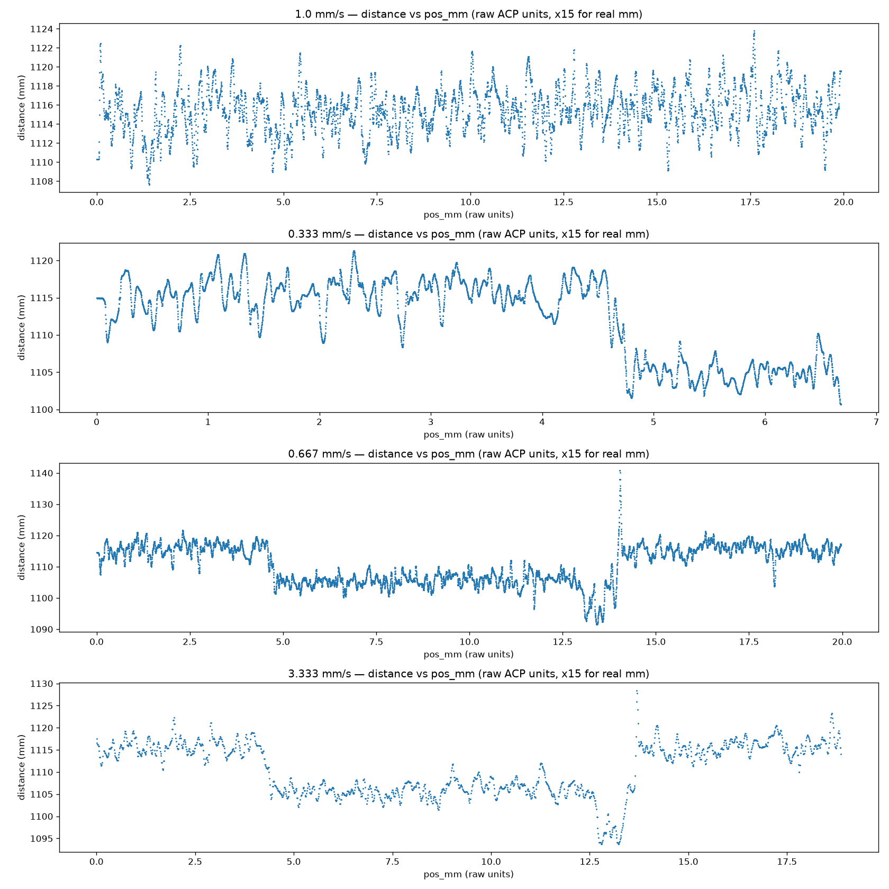
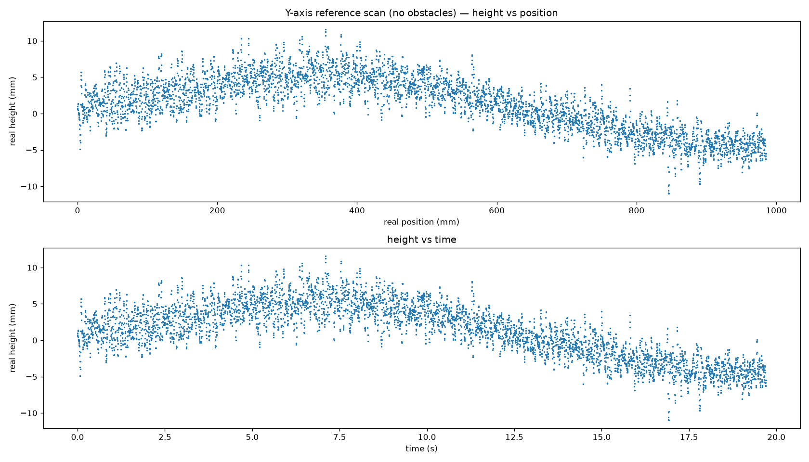
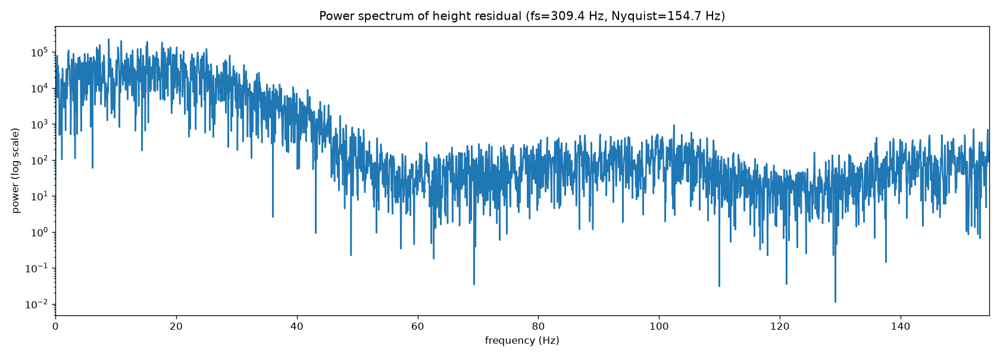
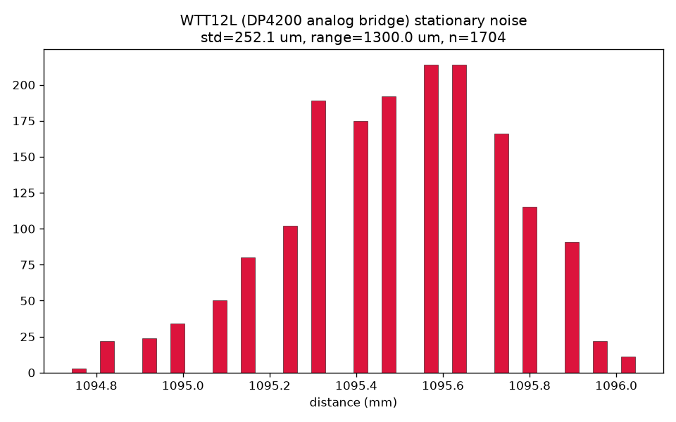

# Rangefinder Sensor Noise Characterization (2026-07-28)

> **Archived 2026-08-05.** Kept for historical context; no longer maintained.

**Status: investigation complete for this pass.** Started from "the scan
output looks noisy, is OD2000 averaging worth tuning?" and ended up finding
that sensor read noise is *not* the dominant source of noise in scan data —
real physical structure (an intentionally-placed obstacle, and separately,
broadband mechanical vibration in the 1-40 Hz range) accounts for far more
of the variation than the sensor itself does. This doc records what was
measured, in case anyone revisits scan noise later and is tempted to
re-derive all of this from scratch.

---

## 1. OD2000 averaging/median filter settings

**Surprise finding: the sensor was already running with substantial default
filtering the whole session**, not the "Speed mode, filters off" this
repo's docs previously assumed. Confirmed via IODD ISDU read
(`iolreadacyclic`, indices below):

| Parameter | ISDU index | Value found | Datasheet default |
|---|---|---|---|
| Average filter | 4373 (0x1115) | 128 | 128 |
| Median filter | 4374 (0x1116) | 31 | 31 |
| Cycle time | 4368 (0x1110) | 0 (Auto) | 0 (Auto) |

`docs/subsystems/rangefinder.md`'s claim of a filters-off "Speed mode" for
profiling was never actually applied on hardware — worth fixing that doc,
or actually applying it, before trusting it again.

### Stationary noise, default vs. lighter filtering

4 s stationary capture, sensor and target both fixed, no gantry motion,
persistent HTTP connection polling (same pattern as scan data collection —
see `docs/MQTT_AL1342_SETUP.md`):

| Config | Raw std | Raw range | True update rate* | Software-smoothed std (window=32) |
|---|---|---|---|---|
| avg=128, median=31 (default) | 91.2 µm | 571.1 µm | 261 Hz | 82.4 µm |
| avg=16, median=15, cycle=133µs | 99.1 µm | 585.9 µm | 302 Hz | 79.7 µm |

*"true update rate" = count of consecutive **unique** pdin values, not the
raw HTTP poll rate (~375-380 Hz in both cases) — a meaningful fraction of
every poll re-reads a stale value that hasn't updated yet at the sensor's
own internal rate.

**Takeaway: lightening the filter from the default barely moves raw noise,
and buys only ~16% more true update rate** (261→302 Hz) — nowhere near the
naive "16x lighter averaging should be ~8x faster" expectation. Both
configs converge to nearly the same noise floor (~80 µm) once comparable
software smoothing is applied — this ~80-90 µm figure looks like a fairly
hard floor for this sensor at ~1.1 m range, not something further averaging
removes. **Conclusion: OD2000 filter tuning is not a productive lever for
the noise actually showing up in scans** — see sections 2-3.

Median filter valid values are discrete (`0, 3, 7, 15, 31`) — there is no
`16` option; `15` was used as the closest available value to what was
originally requested.

---

## 2. Line scan "noise" was mostly a real obstacle, not sensor noise

Four X-axis line scans (`server-setup/plans/scan_output/profile_*.csv`,
2026-07-28 evening) showed strongly **bimodal** distance histograms — two
clusters ~10-15 mm apart, not a single noisy peak:

This turned out to be real: **a ~10mm-thick smartphone was intentionally
placed in the scan path** during several of these scans, at an inconsistent
location run to run. The step in the profile is the sensor correctly
detecting the edge of the phone — not a sensor artifact. Even in the
supposedly-flat regions on either side of the step, though, there was still
several mm of wavy, spatially-correlated structure — far more than the
~91-99 µm stationary sensor-noise floor from section 1, and too structured
(real bumps and dips, not random scatter) to be electronical noise. That
pointed at something else going on physically — see section 3.

**Lesson for next time:** confirm the scan path is actually obstacle-free
before trying to characterize noise from scan data — a stationary baseline
capture (section 1's method) isolates sensor noise far more cleanly than
trying to detrend a moving scan that might have real geometry in it.

---

## 3. Vibration / structural flex — Y-axis reference scan

A Y-axis scan confirmed to have **no obstacles** in the path
(`experiments/scan_output/profile_20260729_002008*.csv`, 5:20pm run, real
feed rate 50 mm/s over ~985mm of travel) still showed:

- A large, smooth "long-wavelength flex" — real height rising ~6mm then
  falling ~9mm over the ~1m scan, consistent with the operator's own
  suspicion of floor/table flex under the sensor mount, not something to
  "fix" as noise.
- After removing that trend (5th-order polynomial fit vs. position),
  residual std was still **~1.8mm** — two orders of magnitude larger than
  the ~91 µm stationary sensor-noise floor.

### FFT of the detrended residual

Interpolated the (slightly irregularly-sampled, ~309 Hz nominal) residual
onto a uniform time grid and took a windowed FFT:

**Finding: broadband power concentrated in ~1-40 Hz, with a sharp knee down
to the noise floor above ~45-50 Hz.** No single dominant tone — the top
several spectral peaks (7-25 Hz) are all similar magnitude, which points to
**multiple overlapping structural vibration modes** (consistent with
"long-wavelength flex" in the floor/table/gantry frame) rather than one
clean mechanical resonance (e.g. a motor cogging tone, which would show as
one sharp spike). A flat spectrum would have indicated electronic sensor
noise instead — that's not what this shows, which is itself evidence the
residual is mostly real mechanical motion, not the sensor.

Cross-check: at this scan's 50 mm/s feed rate, a 20 Hz vibration maps to a
~2.5mm spatial wavelength — consistent with the bumpy structure visible by
eye in the position-domain plot above.

**Actionable takeaway:** if pursuing vibration isolation, the **1-40 Hz**
band is where to look — check gantry frame stiffness, mounting bracket
looseness, and table/floor natural frequency in that range. An accelerometer
directly on the sensor mount would resolve this far more precisely than
position-derived height data can (our effective time resolution here is
capped by ~300 Hz polling); this analysis tells you where to start looking,
not a precise mode identification.

**Caveat:** the 5th-order polynomial detrend used to remove the macro flex
could leak some energy into the lowest few Hz of this spectrum if the real
flex isn't well-approximated by a 5th-order polynomial. Treat the sub-3 Hz
content as less certain than the 5-40 Hz hump, which is well clear of that
detrending boundary.

---

## 4. WTT12L (PowerProx) comparison

Stationary noise capture via the DP4200 analog bridge (see
`docs/WTT12L_POWERPROX_SETUP.md` for why it's not native IO-Link), same
method as section 1, no gantry motion:

| Sensor / config | std | range |
|---|---|---|
| OD2000, avg=128/median=31 (default) | 91.2 µm | 571.1 µm |
| OD2000, avg=16/median=15 | 99.1 µm | 585.9 µm |
| **WTT12L via DP4200 analog bridge** | **252.1 µm** | **1300.0 µm** |

The WTT12L path is ~2.5-2.8x noisier than the OD2000 in open air. Plausible
explanation: this isn't a native distance reading, it's the sensor's
continuous 4-20mA analog output digitized by a separate DP4200 module — an
extra analog conversion stage the OD2000 doesn't have, plus DP4200
quantization (each 1µA raw step ≈ 0.08mm in the decode formula). Still well
within the WTT12L's own rated ±15-20mm accuracy spec.

**Why this sensor is worth the extra noise anyway:** the WTT12L is a
time-of-flight sensor, unlike the OD2000's triangulation-based measurement.
Triangulation geometry (spot displacement across an angled sensor) is
specifically vulnerable to refractive-interface distortion — exactly the
failure mode expected when measuring across an air-water boundary in this
lab's actual application. Time-of-flight measures light travel time
instead, and should be far less sensitive to that effect, even though it's
noisier in open air. **Not yet tested:** a side-by-side OD2000-vs-WTT12L
comparison across a real refractive interface — that's the test that would
actually validate the WTT12L's value proposition, and hasn't been run.

---

## Open items / next steps

1. **Update `docs/subsystems/rangefinder.md`** — it currently claims a
   filters-off "Speed mode" is used for profiling; that was never actually
   applied on hardware. Either apply it or correct the doc.
2. **Physically investigate the 1-40 Hz vibration band** — accelerometer on
   the sensor mount, check gantry frame / table / floor for the actual
   resonant structure, before assuming any particular fix.
3. **OD2000 vs. WTT12L across a real refractive interface** (air-water) —
   the comparison that actually tests the WTT12L's reason for existing in
   this project. Not done yet.
4. Raw capture CSVs for all of the above (`/tmp/od2000_baseline_*.csv`,
   `/tmp/wtt12l_baseline.csv`) were not committed — treat this doc's tables
   and plots as the durable record; regenerate from a fresh stationary
   capture if the raw samples are needed again.
