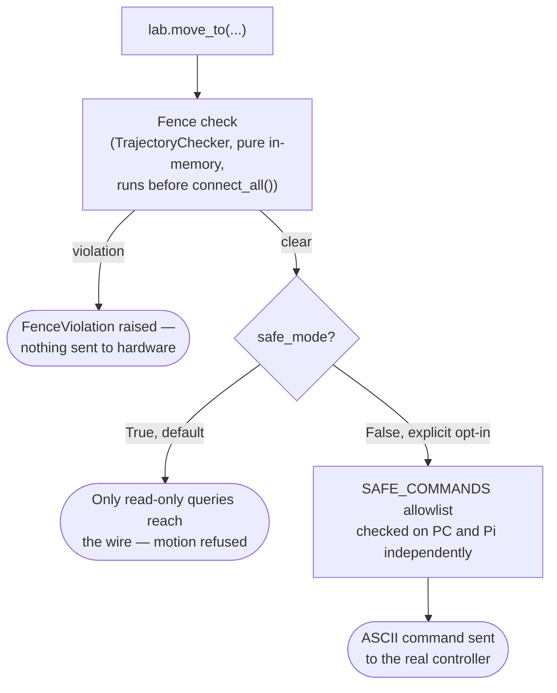

# Driving the gantry safely

The gantry is the one subsystem in this project that can hurt equipment or
people if commanded carelessly. This guide walks through the safety
mechanisms in the order a script actually hits them, using the
`FlumeLab.move_to()` / `acquire_scan()` convenience layer (the same shapes
covered in [`docs/subsystems/rangefinder.md`](../subsystems/rangefinder.md)
and [`docs/MACRON_GANTRY.md`](../MACRON_GANTRY.md)).

**Default to `safe_mode=True`. Never write a script that commands real
motion without explicitly and separately opting in — see this project's
root `CLAUDE.md` for why.**

## The layers, in the order they run



Fence checking happens first and needs no hardware connection at all — it's
pure Python. `safe_mode` gates everything after that: while it's `True`
(the default, everywhere), only read-only queries can reach the hardware,
structurally — a bug in a higher layer cannot bypass it.

## Worked example

```python
from laguna import FlumeLab
from laguna.robot.macron.fences import FenceViolation

ALLOW_MOTION = False   # flip only once you've decided to actually move something

lab = FlumeLab("config/example_config.yaml")

# A keepout zone — e.g. a fixed obstacle in the gantry's travel envelope.
lab.config.config_dict["gantry"]["fences"] = [
    {"type": "box", "name": "equipment_post", "x": [400, 420], "y": [400, 420], "z": [0, 50]},
]

lab.add("gantry")
lab.gantry.set_safe_mode(not ALLOW_MOTION)

# Fence check demo — runs before connecting to anything.
try:
    lab.move_to([410.0, 410.0, 10.0, 0.0])
except FenceViolation as exc:
    print(f"Rejected, as expected: {exc}")

if not lab.connect_all():
    print("Not all subsystems connected — see warnings above.")

if not ALLOW_MOTION:
    print("ALLOW_MOTION is False — no moves will be sent.")
    lab.disconnect_all()
    raise SystemExit(0)

lab.move_to([100.0, 50.0, 10.0, 0.0], speed=10.0)      # full [X, Y, Z, Theta] vector
lab.move_to(X=150.0, speed=10.0)                        # partial move — Y/Z held
lab.disconnect_all()
```

This is a trimmed version of
[`examples/example_07_flumelab_gantry_scan.py`](https://github.com/ericbarefoot/laguna/blob/develop/examples/example_07_flumelab_gantry_scan.py),
which also covers both rangefinders and a full scan — read it in full
before writing a real motion script. The fence-check-then-`ALLOW_MOTION`
pattern there is deliberate: it lets you verify the fence logic and
connection status with **zero risk**, every time you run the script, before
the part that can actually move something.

**Try the whole thing under `simulate=True` first** — see
[Rehearsing safely with `simulate=True`](simulate.md). Fence checking is
real in simulation too, so a rehearsal catches a wrong fence definition or
an out-of-bounds move target with no hardware involved at all.

## Acquiring a topographic scan

Once connected with `ALLOW_MOTION = True` and the sensor activated:

```python
lab.od2000.activate()

result = lab.acquire_scan(
    "od2000",
    start=[0.0, 50.0, 20.0, 0.0],
    end=[100.0, 50.0, 20.0, 0.0],
    feed_rate_mm_s=10.0,
    output="experiments/scan_output/scan.csv",
)
print(f"{result.path} ({result.metadata.get('samples')} samples)")

lab.od2000.deactivate()
```

`acquire_scan()` infers which axis to scan from the single component that
differs between `start` and `end` — both are full `[X, Y, Z, Theta]`
vectors, not just the scanned axis's value.

## Things this guide deliberately does not cover

- **Homing** — currently disabled on the lab's hardware (physical
  obstructions block several limit switches); see `docs/MACRON_GANTRY.md`.
  Scripts that assume a homed reference frame should declare position with
  `lab.gantry.set_position([...])` instead, which commands no motion.
- **Recovering from a power cycle or interrupted session** — see
  "Resuming after a Pi reboot or session gap" in `docs/MACRON_GANTRY.md`.
- **The full safety-verb vocabulary** (`pause`/`resume`/`stop`/`estop`) —
  see `src/laguna/safety.py`'s module docstring, which is the canonical
  reference for what each verb guarantees across every subsystem, not just
  the gantry.
