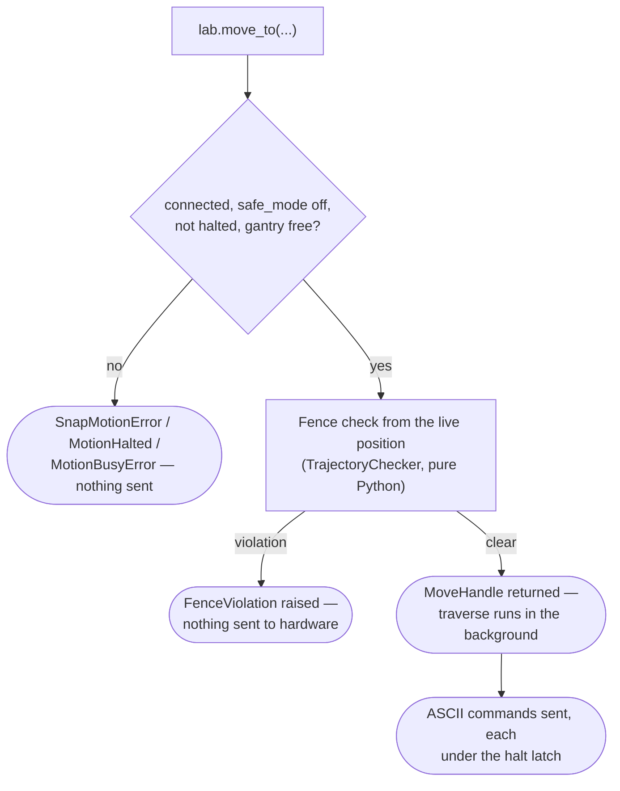

# Driving the gantry safely

The gantry is the one subsystem in this project that can hurt equipment or
people if commanded carelessly. This guide walks through the safety
mechanisms in the order a script actually hits them, using the
`FlumeLab.move_to()` / `acquire_scan()` convenience layer (the same shapes
covered in [`docs/subsystems/rangefinder.md`](../subsystems/rangefinder.md)
and [`docs/MACRON_GANTRY.md`](../MACRON_GANTRY.md)).

**Default to `safe_mode=True`. Never write a script that commands real
motion without explicitly and separately opting in — see this project's
root `CLAUDE.md` for why.**

## The layers, in the order they run


```mermaid
flowchart TD
    Call["lab.move_to(...)"] --> Gate{"connected, safe_mode off,\nnot halted, gantry free?"}
    Gate -->|no| Refuse(["SnapMotionError / MotionHalted /\nMotionBusyError — nothing sent"])
    Gate -->|yes| Fence["Fence check from the live position\n(TrajectoryChecker, pure Python)"]
    Fence -->|violation| Reject(["FenceViolation raised —\nnothing sent to hardware"])
    Fence -->|clear| Handle(["MoveHandle returned —\ntraverse runs in the background"])
    Handle --> Wire(["ASCII commands sent, each\nunder the halt latch"])
```

All of that happens on your thread before `move_to()` returns, so any
refusal raises right there. `safe_mode` is checked client-side for every
motion path and, on the Pi transport, again on the PC and the Pi
independently. The full map of which calls are fenced (everything except
homing and the explicitly named `*_unfenced` calls) is in
[`docs/MOTION_CONTROL_LAYERS.md`](../MOTION_CONTROL_LAYERS.md).

## Worked example

```python
from laguna import FlumeLab

ALLOW_MOTION = False   # flip only once you've decided to actually move something

lab = FlumeLab("config/example_config.yaml")

# A keepout zone — e.g. a fixed obstacle in the gantry's travel envelope.
lab.config.config_dict["gantry"]["fences"] = [
    {"type": "box", "name": "equipment_post", "x": [400, 420], "y": [400, 420], "z": [0, 50]},
]

lab.add("gantry")

# Fence check demo — pure Python, runs before connecting to anything.
violations = lab.gantry.checker.check_ribbon((0.0, 0.0, 10.0), (410.0, 410.0, 10.0))
print(f"Rejected, as expected: {violations[0]}")

if not lab.connect_all():
    print("Not all subsystems connected — see warnings above.")
lab.gantry.set_safe_mode(not ALLOW_MOTION)   # needs a live connection to disable

if not ALLOW_MOTION:
    print("ALLOW_MOTION is False — no moves will be sent.")
    lab.disconnect_all()
    raise SystemExit(0)

# move_to() returns as soon as the move has started; .wait() to sequence.
lab.move_to([100.0, 50.0, 10.0, 0.0], speed=10.0).wait()   # full [X, Y, Z, Theta] vector
lab.move_to(X=150.0, speed=10.0).wait()                     # partial move — Y/Z held
lab.disconnect_all()
```

This is a trimmed version of
[`examples/example_07_flumelab_gantry_scan.py`](https://github.com/ericbarefoot/laguna/blob/develop/examples/example_07_flumelab_gantry_scan.py),
which also covers both rangefinders and a full scan — read it in full
before writing a real motion script. The fence-check-then-`ALLOW_MOTION`
pattern there is deliberate: it lets you verify the fence logic and
connection status with **zero risk**, every time you run the script, before
the part that can actually move something.

**Try the whole thing under `simulate=True` first** — see
[Rehearsing safely with `simulate=True`](simulate.md). Fence checking is
real in simulation too, so a rehearsal catches a wrong fence definition or
an out-of-bounds move target with no hardware involved at all.

## Stopping from a notebook

Because `move_to()` doesn't block, keep `lab.pause()` in a cell by itself
and run it any time — the move in flight is cancelled (its next leg is never
issued) and new motion is refused until `lab.resume()`. `lab.estop()` is the
hard version; recovering from it takes `lab.rearm()`, which leaves the
gantry in `safe_mode` until you explicitly call
`lab.gantry.set_safe_mode(False)` again.

## Acquiring a topographic scan

Once connected with `ALLOW_MOTION = True` and the sensor activated:

```python
lab.od2000.activate()

result = lab.acquire_scan(
    "od2000",
    start=[0.0, 50.0, 20.0, 0.0],
    end=[100.0, 50.0, 20.0, 0.0],
    feed_rate_mm_s=10.0,
    output="experiments/scan_output/scan.csv",
)
print(f"{result.path} ({result.metadata.get('samples')} samples)")

lab.od2000.deactivate()
```

`acquire_scan()` infers which axis to scan from the single component that
differs between `start` and `end` — both are full `[X, Y, Z, Theta]`
vectors, not just the scanned axis's value.

## Things this guide deliberately does not cover

- **Homing** — see `docs/MACRON_GANTRY.md` and `HomingProcedure`/
  `lab.gantry.home()`. Scripts that don't want to run a physical homing
  pass can declare position instead with `lab.gantry.set_position([...])`,
  which commands no motion.
- **Recovering from a power cycle or interrupted session** — see
  "Resuming after a Pi reboot or session gap" in `docs/MACRON_GANTRY.md`.
- **The full safety-verb vocabulary** (`pause`/`resume`/`stop`/`estop`) —
  see `src/laguna/safety.py`'s module docstring, which is the canonical
  reference for what each verb guarantees across every subsystem, not just
  the gantry.
