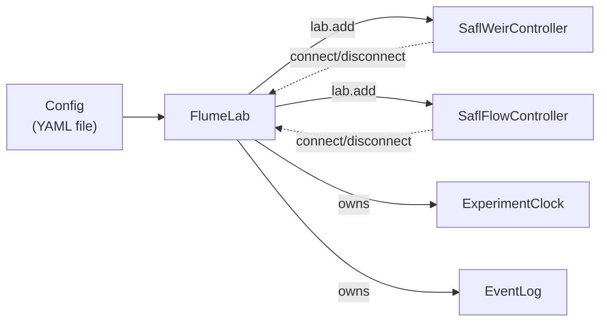

# Getting started: your first FlumeLab experiment

This walks through the smallest complete experiment: connect two
subsystems, run them for a fixed duration under the scheduler's clock, and
disconnect cleanly. Every real experiment script is a bigger version of
this same shape.

## The pieces



`FlumeLab` doesn't know about weirs or pumps itself — it owns the shared
clock, scheduler, and event log, and coordinates whatever subsystems you
register with `lab.add()`. Nothing is opt-in until you add it.

## The full script

```python
from laguna import FlumeLab
from laguna.weir import SaflWeirController
from laguna.flow import SaflFlowController

lab = FlumeLab("config/example_config.yaml")

lab.add(SaflWeirController(lab.config.get("weir")))
lab.add(SaflFlowController(lab.config.get("flow")))

if not lab.connect_all():
    print("One or more subsystems failed to connect — aborting.")
    raise SystemExit(1)

with lab.experiment() as clock:
    lab.weir.home()
    lab.weir.set_elevation(150.0)   # mm

    lab.flow.start()
    lab.flow.set_flowrate(20.0)     # L/min

    clock.wait_until(60.0)          # run for 60 s

    lab.flow.stop()

lab.disconnect_all()
```

Run it verbatim as [`examples/example_02_experiment.py`](https://github.com/ericbarefoot/laguna/blob/develop/examples/example_02_experiment.py).

## What each part does

- **`FlumeLab("config/example_config.yaml")`** loads config but connects to
  nothing yet — subsystems are opt-in via `lab.add()`.
- **`lab.add(subsystem_instance)`** registers a subsystem under its
  `subsystem_name` attribute — after this, `lab.weir` and `lab.flow` exist.
  You can also add a subsystem by name string (`lab.add("weir")`), which
  looks it up in `laguna.registry` and builds it from config for you — see
  [`example_07`](https://github.com/ericbarefoot/laguna/blob/develop/examples/example_07_flumelab_gantry_scan.py) for that
  form.
- **`lab.connect_all()`** opens every registered subsystem's connection and
  returns `False` if any of them failed — always check this before
  proceeding, since a partially-connected lab is not a safe state to run
  motion or acquisition from.
- **`with lab.experiment() as clock:`** starts the clock and event log,
  and guarantees they're stopped/flushed on the way out — even if the body
  raises. `clock` is the same `ExperimentClock` as `lab.clock`; the
  context manager just hands it to you for convenience.
- **`clock.wait_until(60.0)`** blocks until 60 seconds of experiment
  runtime have elapsed — not 60 seconds of wall-clock time, which matters
  once pause/resume or a `speed_factor` rehearsal are in play (see
  [Rehearsing safely with `simulate=True`](simulate.md)).
- **`lab.disconnect_all()`** always runs at the end, even on the "abort
  early" path above — leaving hardware connected after a script exits is
  how you end up fighting a stale connection next time.

## Before you touch real hardware

Run this exact script with `simulate=True` first — see
[Rehearsing safely with `simulate=True`](simulate.md). It catches
structural mistakes (a typo'd config key, a subsystem that never actually
gets added) with zero risk, before you're troubleshooting them against
real motors and pumps.
