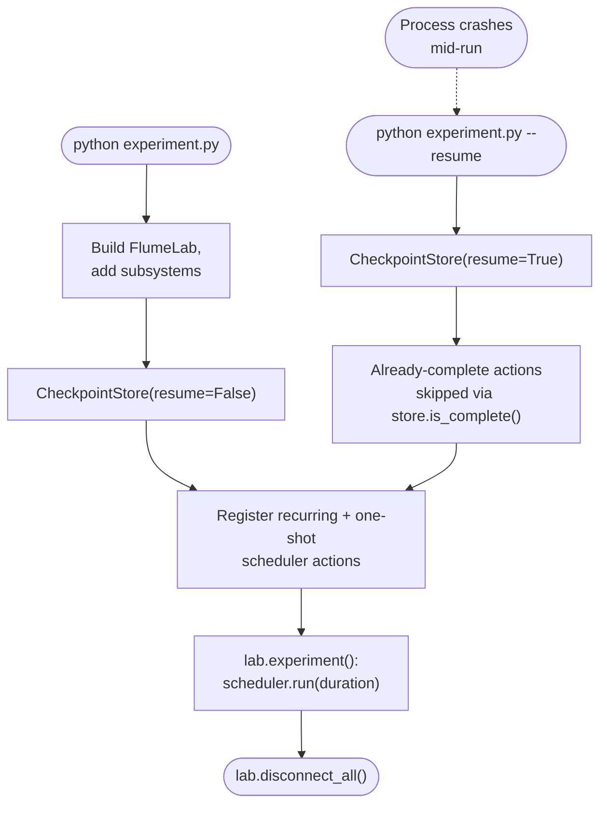

# Scheduling a multi-subsystem experiment, with checkpoint/resume

Real experiments aren't one linear script — they're a mix of recurring
polls (log hydraulics status every 5 s) and one-shot actions at specific
times (trigger every camera at t=10s, t=20s, ...). `lab.scheduler` handles
both, and `CheckpointStore` means a crash partway through doesn't cost you
the captures that already succeeded.

## The flow



## Worked example

```python
import argparse
import logging
from pathlib import Path

from laguna import FlumeLab, CheckpointStore
from laguna.camera import CameraManager

logging.basicConfig(level=logging.INFO, format="%(asctime)s %(levelname)s %(message)s")

CAPTURE_TIMES = [10, 20, 30, 40, 50, 60]   # runtime seconds
EXPERIMENT_DURATION = 75                   # seconds
CHECKPOINT_FILE = "./experiment_checkpoint.json"

CAMERA_CONFIGS = [
    {
        "name": "pi_array",
        "type": "network",
        "hosts": ["antares.laguna", "sirius.laguna"],
        "ssh_user": "pi",
        "ssh_key": "~/.ssh/id_rsa",
        "lead_time": 5.0,
        "output_dir": "./captures",
    }
]


def main(resume: bool) -> None:
    lab = FlumeLab("config/example_config.yaml")
    lab.add(CameraManager(CAMERA_CONFIGS))

    if not lab.connect_all():
        logging.error("Could not connect all subsystems — aborting.")
        return

    store = CheckpointStore(CHECKPOINT_FILE, resume=resume)

    # Recurring action: fires every 5s of experiment runtime.
    lab.scheduler.repeat(
        every=5,
        action=lab.hydraulics.get_status,
        subsystem="hydraulics",
        name="status_poll",
    )

    # One-shot actions: each fires once, at its own runtime offset.
    for i, t in enumerate(CAPTURE_TIMES):
        if store.is_complete(i):
            logging.info("Capture %d (t=%ds) already complete — skipping.", i, t)
            continue

        def _capture(capture_idx=i, capture_t=t):
            results = lab.cameras.trigger_capture()
            lab.cameras.report_simultaneity(results)
            lab.cameras.fetch_images(results, output_dir=Path("./captures"))
            store.mark_complete(
                capture_idx,
                runtime_s=lab.clock.elapsed(),
                wall_time=lab.clock.wall_time(),
                name=f"capture_{capture_idx}",
            )

        lab.scheduler.at(runtime_s=t, action=_capture, subsystem="camera", name=f"capture_{i}")

    with lab.experiment(resume=resume, checkpoint_file=CHECKPOINT_FILE) as clock:
        logging.info("Experiment started. Duration: %ds", EXPERIMENT_DURATION)
        lab.scheduler.run(duration=EXPERIMENT_DURATION)
        logging.info("Scheduler finished. Runtime: %.1fs", clock.elapsed())

    lab.disconnect_all()
    logging.info("Done.")


if __name__ == "__main__":
    parser = argparse.ArgumentParser()
    parser.add_argument("--resume", action="store_true", help="Resume from checkpoint")
    args = parser.parse_args()
    main(resume=args.resume)
```

Run it verbatim as
[`examples/example_04_scheduled_experiment.py`](https://github.com/ericbarefoot/laguna/blob/develop/examples/example_04_scheduled_experiment.py).

## Why the checkpoint pattern matters

Per this project's data-preservation priority (see the root `CLAUDE.md`), a
missed scan or dropped frame can't be redone by rerunning the script from
the top — the water conditions have moved on. `CheckpointStore` lets a
crashed or interrupted run resume exactly where it left off:

- Each one-shot action checks `store.is_complete(i)` **before** doing any
  work, and skips if it already succeeded on a prior run.
- `store.mark_complete(i, ...)` is called only *after* the work succeeds —
  never mark complete first and do the work second, or a crash mid-action
  looks like success on resume.
- Pass `--resume` (which flows into both `CheckpointStore(resume=True)` and
  `lab.experiment(resume=True, ...)`) to pick up a crashed run rather than
  starting over.

## Try it with no hardware first

This exact pattern works under `simulate=True` too — see
[Rehearsing safely with `simulate=True`](simulate.md) — which is the
right way to prove a new schedule is well-formed (fires in the right
order, no subsystem left un-added) before pointing it at real cameras and
hydraulics.
